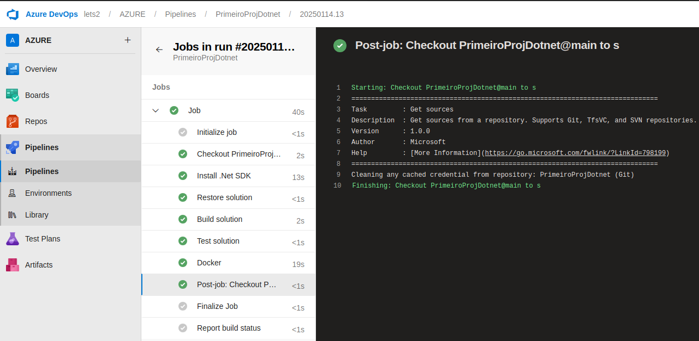

# Weather Forecast - Dotnet

## Introduction

Este projeto é uma API simples em .NET Core que fornece previsões meteorológicas fictícias aleatórias. Ele serve como um exemplo a construção de APIs RESTful com .NET, incluindo um Swagger para documentação de rotas. Além disso, conta com um pipeline para estudo de CI/CD.

## Alguns pontos importantes

-   Conhecer o .NET, principais arquivos e diretórios, além de buildar e executar uma aplicação
-   Desenvolver um Dockerfile funcional para a aplicação
-   Criar um pipeline no Azure DevOps e ir adicionando tasks
-   Criar agent self-hosted para conseguir executar o pipeline
-   habilitar service connection com o docker hub para build e push das imagens

## Capturas de tela




## Getting Started

### Requisitos

-   [.NET 8.0 SDK](https://dotnet.microsoft.com/download/dotnet/8.0) ou superior instalado.
-   Docker (opcional, para execução em contêiner).

### Instalação e Execução

1. Clone o repositório:
    ```bash
    git clone <url>
    cd weatherapi
    ```

## Iniciando a aplicação

A partir da raiz do projeto, aplique este comando para efetuar a inicialização:

```
dotnet run
```

## Acessar a documentação da API

```
http://localhost:5074/swagger/
```

## Fazer uma requisição para a API

```bash
curl -X 'GET' \
  'http://localhost:5074/weatherforecast' \
  -H 'accept: application/json'
```

## Exemplo de resposta

```json
[
    {
        "date": "2025-01-14",
        "temperatureC": -20,
        "summary": "Warm",
        "temperatureF": -3,
        "temperatureK": 253
    },
    {
        "date": "2025-01-15",
        "temperatureC": 1,
        "summary": "Cool",
        "temperatureF": 33,
        "temperatureK": 274
    },
    {
        "date": "2025-01-16",
        "temperatureC": -19,
        "summary": "Scorching",
        "temperatureF": -2,
        "temperatureK": 254
    },
    {
        "date": "2025-01-17",
        "temperatureC": 54,
        "summary": "Scorching",
        "temperatureF": 129,
        "temperatureK": 327
    },
    {
        "date": "2025-01-18",
        "temperatureC": 4,
        "summary": "Warm",
        "temperatureF": 39,
        "temperatureK": 277
    }
]
```

# Build da imagem a partir do Dockerfile

```
docker build -t weatherapi:v1.0.0 .
```

# Execução do container a partir da imagem

```
docker run -d -p 5074:5074 weatherapi:v1.0.0
```

# Fazer login a partir do terminal no Docker hub

```
docker login
```

# Fazer push da imagem para o registry Docker hub

```
docker push fulano/weatherapi:v1.0.0
```
